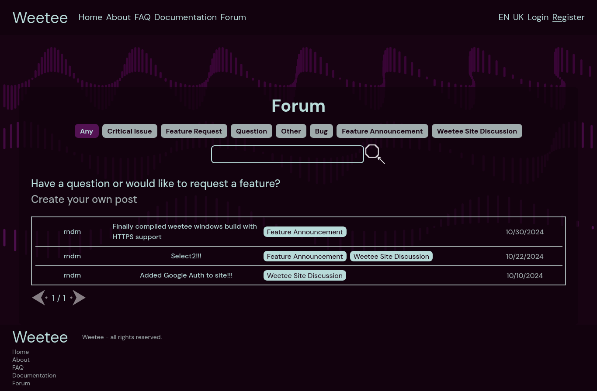
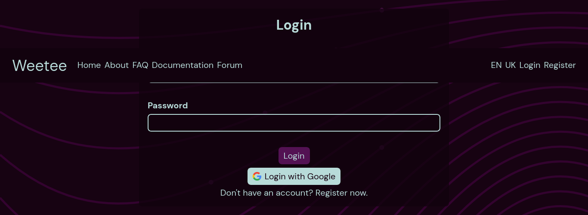
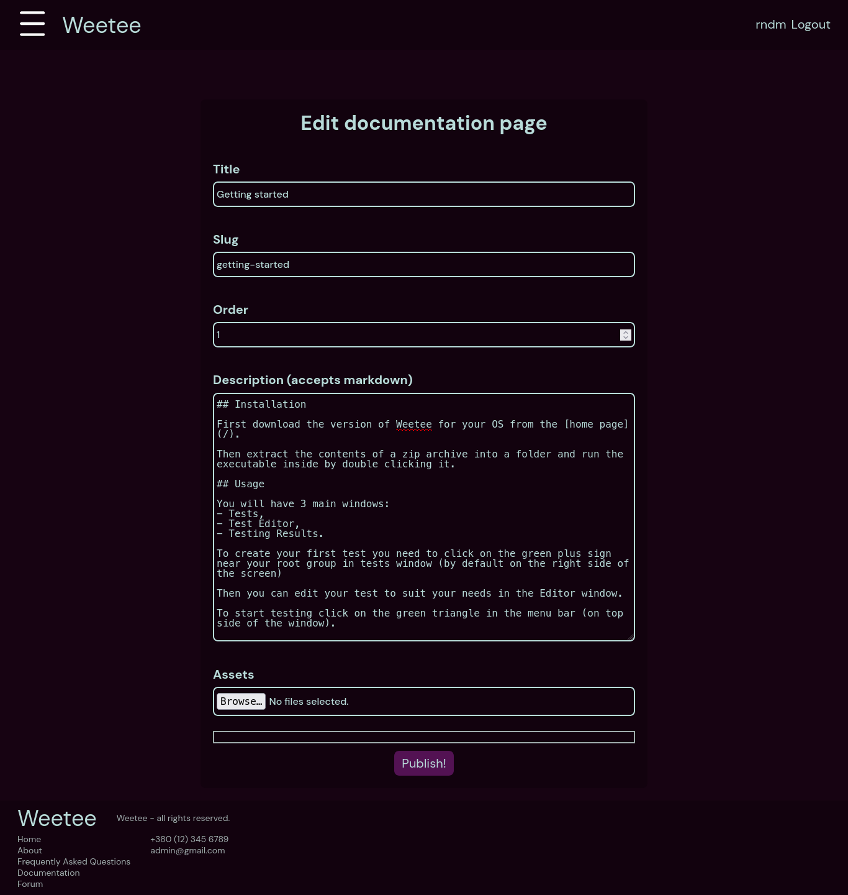

# Site for Weetee, the API testing tool

This is a simple site that features a nice looking landing page, a forum and a documentation which can be edited in the admin dashboard

## Installation

```sh
git clone https://github.com/rndm13/weetee-site.git 
cd weetee-site
composer i
npm i
php artisan serve && npm run dev // run both of them at the same time
```

## Screenshots





